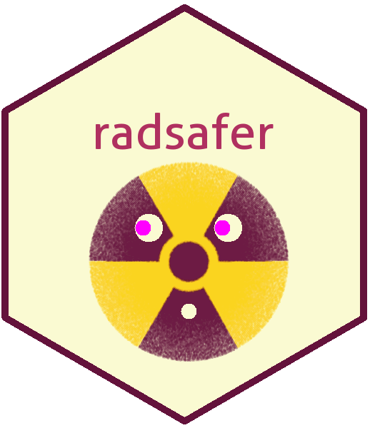

<!-- README.md is generated from README.Rmd. Please edit that file -->

```{r setup, include = FALSE}
knitr::opts_chunk$set(
  collapse = TRUE,
  comment = "#>",
  fig.path = "man/figures/README-",
  out.width = "100%"
)
```
# radsafer  

The goal of radsafer is to provide functions that are useful for radiation safety professionals.

## Installation

You can install the released version of radsafer from [CRAN](https://CRAN.R-project.org) with:

``` r
install.packages("radsafer")
```
Or install the development version from GitHub:
 
```{r eval = FALSE}
# install.packages("devtools")
devtools::install_github("markhogue/radsafer")
```

## Oveview
To start using the installed package: 

```{r}
library(radsafer)
```

## radsafer families of functions

*  Related functions are identified as members of families:
   + rad measurements 
   + mcnp tools 
   + decay corrections 
   + radionuclides 


### Decay Correction Functions
Radsafer includes several functions to manage radioactive decay corrections:

**dk_cf** provides a correction factor. Revise a calibration or source check value to today's date (the default) or a date and time of your choosing. 

```{r}
dk_cf(half_life = 5.27, date1 = "2010-12-01", date2 = "2018-12-01", time_unit = "y")
```
Use this function to correct for the value needed today. Say, a disk source originally had a target count rate of 3000 cpm:
```{r}
3000 * dk_cf(half_life = 5.27, date1 = "2010-12-01", date2 = "2018-12-01", time_unit = "y")
```

Other decay functions answer the following questions: 
* What is the decayed activity? **dk_activity**, Given a percentage reduction in activity, how many half-lives have passed.**dk_pct_to_num_half_life**

* How long will it take to reach the target radioactivity? **dk_time**

* Given the radioactivity at one time, what was the radioactivity at an earlier time? **dk_reverse**

* Given two data points, estimate the half-life: **half_life_2pt**

### rad measurements functions
**air_dens_cf**
Correct _vented ion chamber readings_ based on difference in air pressure (readings in degrees Celsius and mm Hg):
```{r}
air_dens_cf(T.actual = 30, P.actual = 760, T.ref = 20, P.ref = 760)
```
Let's try it out combined with the instrument reading:
```{r}
rdg <- 100
(rdg_corrected <- rdg * air_dens_cf(T.actual = 30, P.actual = 760, T.ref = 20, P.ref = 760))
```

**neutron_geom_cf**

Correct for _geometry_ when reading a close _neutron_ source. Example: neutron rem detector with a radius of 11 cm and source near surface:
```{r}
neutron_geom_cf(11.1, 11)
```

**disk_to_disk_solid_angle**

Correct for a mismatch between the _source calibration_ of a _counting system_ and the item being measured. A significant factor in the counting efficiency is the solid angle from the source to the detector. You can also check for the impact of an item not being centered with the detector.

Example: You are counting an air sample with an active collection diameter of 45 mm, your detector has a radius of 25 mm and there is a gap between the two of 5 mm. (The function is based on radius, not diameter so be sure to divide the diameter by two.) The relative solid angle is:

```{r}
(as_rel_solid_angle <- as.numeric(disk_to_disk_solid_angle(r.source = 45/2, gap = 20, r.detector = 12.5, runs = 1e4, plot.opt = "n")))
```

An optional plot is available in 2D or 3D:
```{r out.width = '50%'}
(as_rel_solid_angle <- as.numeric(disk_to_disk_solid_angle(r.source = 45/2, gap = 20, r.detector = 12.5, runs = 1e4, plot.opt = "3d")))
```
 
Continuing the example: the only calibration source you had available with the appropriate isotope has an active diameter of 20 mm. Is this a big deal? Let's estimate the relative solid angle of the calibration, then take a ratio of the two.

```{r}
(cal_rel_solid_angle <- disk_to_disk_solid_angle(r.source = 20, gap = 20, r.detector = 12.5, runs = 1e4, plot.opt = "n"))
```
Correct for the mismatch:
```{r}
(cf <- cal_rel_solid_angle / as_rel_solid_angle)
```
This makes sense - the air sample has particles originating outside the source radius, so more of them will be lost, thus an adjustment is needed for the activity measurement.

**scaler_sim**

_Scaler counts_: obtain quick distributions for parameters of interest:
```{r out.width = '50%'}
scaler_sim(true_bkg = 50, true_samp = 10, ct_time = 20, trials = 1e5)
```

**rate_meter_sim**

_Rate meters_: In the ratemeter simulation, readings are plotted once per second for a default time of 600 seconds. The meter starts with a reading of zero and builds up based on the time constant. Resolution uncertainty is established to express the uncertainty from reading an analog scale, including the instability of its readings. Many standard references identify the precision or resolution uncertainty of analog readings as half of the smallest increment. This should be considered the single coverage uncertainty for a very stable reading. When a reading is not very stable, evaluation of the reading fluctuation is evaluated in terms of numbers of scale increments covered by meter indication over a reasonable evaluation period. Example with default time constant:
```{r out.width = '50%'}
rate_meter_sim(cpm_equilibrium = 270, meter_scale_increments = seq(100, 1000, 20))
```

To estimate _time constant_, use `tau.estimate`

### Stay-time computation

Given a dose rate, dose allowed, and a safety margin (default = 20%), calculate stay time with: `stay_time`
```{r}
stay_time(dose_rate = 120, dose_allowed = 100, margin =  20)
```

### mcnp tools functions

If you create MCNP inputs, these functions may be helpful:

**mcnp_si_sp_RD**
Obtain emission data from the RadData package and write to a file for use with the radiation transport code, MCNP.

**mcnp_si_hist** and **mcnp_sp_hist**

* Create an _energy distribution_ from histogram data with: `si_hist` and `sp_hist` (Load the data into R first using copy and paste with `scan` or reading from an external table with, for example, `read.table`.)

**mcnp_matrix_rotations**

* Determine the entries needed for MCNP _coordinate transformation rotation_ 

**mcnp_cone_angle**

* Quickly obtain the _cone angle_ entry

**mcnp_plot_out_spec**

For _MCNP outputs_, plot the results of a tally with _energy bins_. Either first save your data to a text file, or copy and paste it using `mcnp_scan2spec.df`. Then plot it using your favorite method, or do a quick plot with `mcnp_plot_out_spec`:

```{r echo = FALSE}
plot_data <- photons_cs137_hist[1:16, ]
```
```{r out.width = '50%', warning=FALSE, message=FALSE}
mcnp_plot_out_spec(photons_cs137_hist, 'example Cs-137 well irradiator')
```

### radionuclides
Search by alpha, beta, photon or use the general screen option.

`search_phot_by_E` allows screening based on energy, half-life, and minimum probability.

Here's a search for photon energy between 0.99 and 1.01 MeV, half-life between 13 and 15 minutes, and probability at least 1e-4

```{r echo = TRUE}
search_results <- search_phot_by_E(0.99, 1.01, 13 * 60, 15 * 60, 1e-4)
```
```{r echo = FALSE}
knitr::kable(search_results)
```

The `RN_screen` function helps find a radionuclide of interest based on decay mode, half-life, and total emission energy.

In this example, we search for radionuclides decaying by spontaneous fission with half-lives between 6 months and 2 years.

```{r echo = TRUE}
RNs_selected <- RN_screen(dk_mode = "SF", min_half_life_seconds = 0.5 * 3.153e7, max_half_life_seconds = 2 * 3.153e7)
```

```{r echo = FALSE}
knitr::kable(RNs_selected[, c(1:3)])
```

Other radionuclides family functions provide specific activity and short tables of decay data.