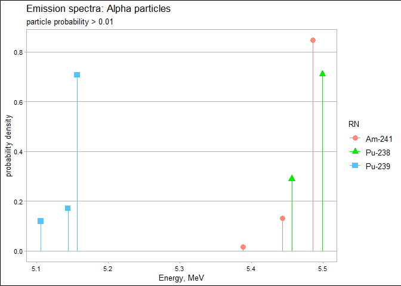
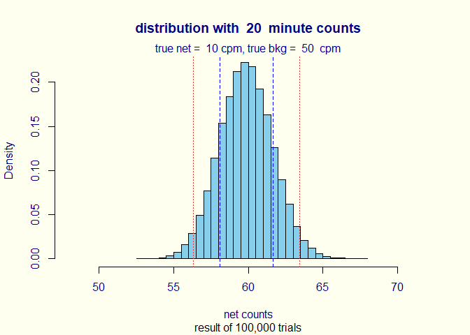

<!-- README.md is generated from README.Rmd. Please edit that file -->
radsafer
========

The goal of radsafer is to provide functions that are useful for radiation safety professionals.

Installation
------------

You can install the released version of radsafer from [CRAN](https://CRAN.R-project.org) with:

``` r
install.packages("radsafer")
```

Or install the development version from GitHub:

``` r
# install.packages("devtools")
devtools::install_github("markhogue/radsafer")
```

Oveview
-------

To start using the installed package:

``` r
library(radsafer)
```

### Decay Correction Functions

Radsafer includes several functions to manage radioactive decay corrections:

`dk_cf` provides a correction factor. Revise a calibration or source check value to today's date (the default) or a date and time of your choosing.

``` r
dk_cf(half_life = 5.27, date1 = "2010-12-01", date2 = "2018-12-01", time_unit = "y")
#> [1] 0.3491632
```

Use this function to correct for the value needed today. Say, a disk source originally had a target count rate of 3000 cpm:

``` r
3000 * dk_cf(half_life = 5.27, date1 = "2010-12-01", date2 = "2018-12-01", time_unit = "y")
#> [1] 1047.49
```

Other decay functions answer the following questions: \* What is the decayed activity? `dk_activity`, Given a percentage reduction in activity, how many half-lives have passed.`dk_pct_to_num_half_life`

-   How long will it take to reach the target radioactivity? `dk_time`

-   Given the radioactivity at one time, what was the radioactivity at an earlier time? `dk_reverse`

-   Given two data points, estimate the half-life: `half_life_2pt`

### Instrumentation functions

Correct *vented ion chamber readings* based on difference in air pressure (readings in degrees Celsius and mm Hg):

``` r
air_dens_cf(T.actual = 30, P.actual = 760, T.ref = 20, P.ref = 760)
#> [1] 1.034112
```

Correct for *geometry* when reading a close *neutron* source. Example: neutron rem detector with a radius of 11 cm and source near surface:

``` r
neutron_geom_cf(11.1, 11)
#> [1] 0.7236467
```

*Scaler counts*: obtain quick distributions for parameters of interest:

``` r
 scaler_sim(true_bkg = 50, true_samp = 10, ct_time = 20, trials = 1e5)
```


*Rate meters*: Ratemeter readings are plotted once per second for 600 seconds. The meter starts with a reading of zero and builds up based on the time constant. Resolution uncertainty is established to express the uncertainty from reading an analog scale, including the instability of its readings. Many standard references identify the precision or resolution uncertainty of analog readings as half of the smallest increment. This should be considered the single coverage uncertainty for a very stable reading. When a reading is not very stable, evaluation of the reading fluctuation is evaluated in terms of numbers of scale increments covered by meter indication over a reasonable evaluation period. Example with default time constant:

``` r
rate_meter_sim(cpm_equilibrium = 270, meter_scale_increments = seq(100, 1000, 20))
```

 To estimate *time constant*, use `tau.estimate`

### Stay-time computation

Given a dose rate, dose allowed, and a safety margin (default = 20%), calculate stay time with: `stay_time`

``` r
stay_time(dose_rate = 120, dose_allowed = 100, margin =  20)
#> [1] "Time allowed is 40 minutes"
```

### MCNP utility functions

If you create MCNP inputs, these functions may be helpful:

-   Create an *energy distribution* from histogram data with: `si_hist` and `sp_hist` (Load the data into R first using copy and paste with `scan` or reading from an external table with, for example, `read.table`.)

-   Determine the entries needed for MCNP *coordinate transformation rotation* with `rot_fun`

-   Quickly obtain the *cone angle* entry with `tan_d2`

-   For *MCNP outputs*, plot the results of a tally with *energy bins*:

``` r
plot_spec_from_hist(plot_data, "mR_h", "Example: Cs-137 with scatter")
```


