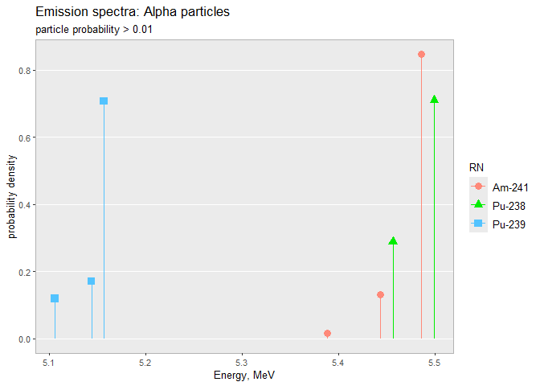
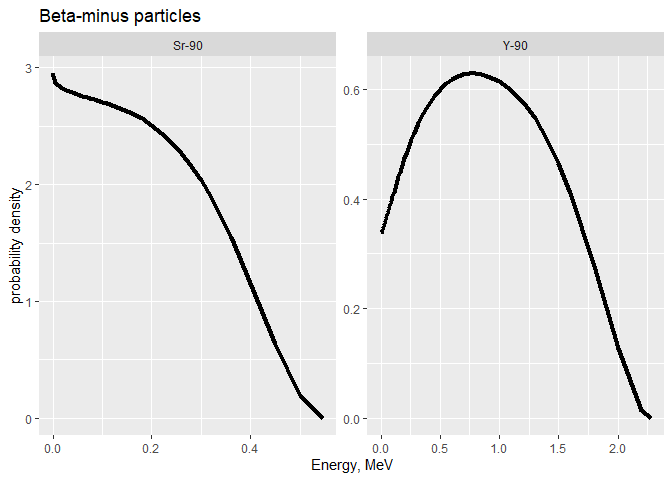
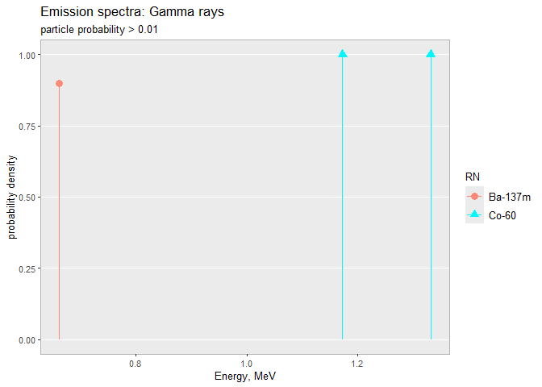
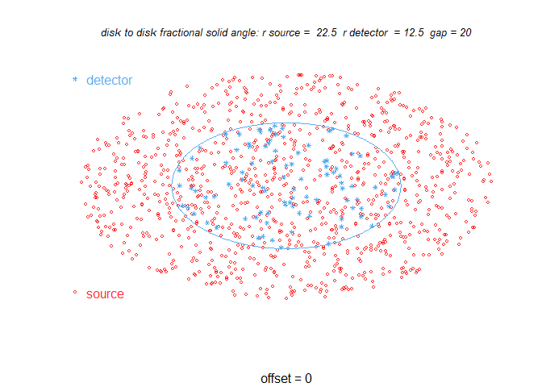
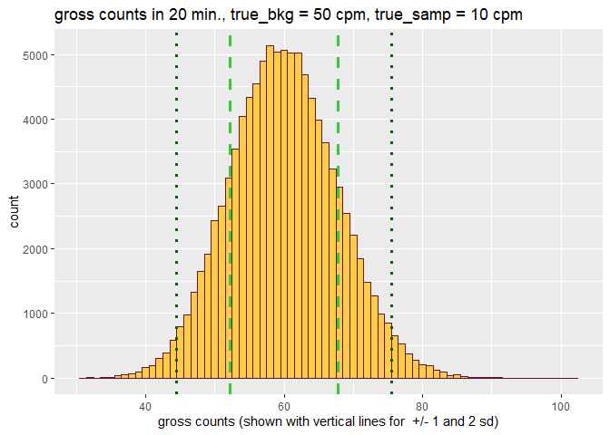
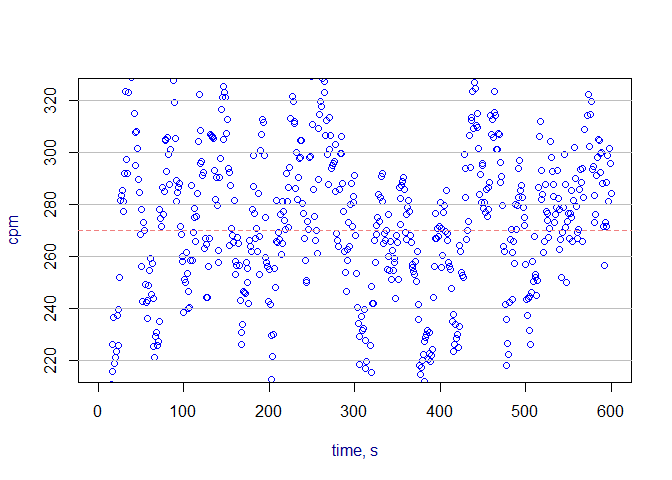

<!-- README.md is generated from README.Rmd. Please edit that file -->

# radsafer </a>

<!-- badges: start -->

[](https://cran.r-project.org/package=radsafer)
<!-- badges: end -->

## Overview

The radsafer package was developed to provide:

- general functions helpful in the practice of radiation safety, for
  example, decay-corrections

- easy access to radionuclide data from the `RadData` package

- functions for instrumentation and radiation transport modeling

## Families of functions

Related functions are identified as members of these families:

- decay corrections

- radionuclides

- radiation measurements

- mcnp tools

- and a few stand alone functions

### Decay Correction Functions

Radsafer includes several functions to manage radioactive decay
corrections:

**dk_correct** provides decay-correction of single radionuclides.
(Radioactive in-growth is not accounted for.)

#### Usage Examples

##### Use the radionuclide library to find the half-life

``` r
dk_correct(RN_select = "Sr-90",
           date1 = "2015-01-01", #Original activity date
           date2 = c("2025-01-01","2035-01-01"), #Decay to these dates
           A1 = 10000) #Original activity (arbitrary units)
#>     RN half_life units decay_mode
#>  Sr-90     28.79     y         B-
#> 
#>     RN RefValue    RefDate   TargDate dk_value
#>  Sr-90    10000 2015-01-01 2025-01-01 7860.079
#>  Sr-90    10000 2015-01-01 2035-01-01 6178.491
```

##### Enter your own half-life

``` r
dk_correct(half_life = 10, #10 something - need unit
           time_unit = "y",#unit is years
           date1 = "2010-01-01") #original date is identified 
#>  half_life RefValue    RefDate   TargDate  dk_value
#>         10        1 2010-01-01 2026-07-14 0.3179556
# Since date2 is not identified, it defaults to the computer's system date "today".
```

##### Reverse usage is no problem - find out activity at a past date

``` r
dk_correct(RN_select = "Cs-137", 
           date1 = "2026-01-01", #known activity on this date
           date2 = c("2016-01-01","2006-01-01"), #find activity on these earlier dates
           A1 = 3000) #original activity (arbitrary units)
#>      RN half_life units decay_mode
#>  Cs-137   30.1671     y         B-
#> 
#>      RN RefValue    RefDate   TargDate dk_value
#>  Cs-137     3000 2026-01-01 2016-01-01 3775.032
#>  Cs-137     3000 2026-01-01 2006-01-01 4749.991
```

##### Other decay functions:

- How long does it take to decay something with a given activity, or how
  old is a sample if it has decayed from?

``` r
dk_time(half_life = 5730, A0 = 14, A1 = 1)
#> [1] 21816.14
  
RN_find_parent("Po-210")
#>       RN
#> 1 At-210
#> 2 Bi-210
```

### Extract radionuclide data from `RadData`

Plot an emission spectrum

``` r
RN_plot_spectrum(
  desired_RN = c("Pu-238", "Pu-239", "Am-241"), rad_type = "A",
  photon = FALSE, prob_cut = 0.01, log_plot = 0)
```



``` r

RN_plot_spectrum(
     desired_RN = c("Sr-90", "Y-90"), rad_type = "B-")
```



``` r

RN_plot_spectrum(desired_RN = c("Co-60", "Ba-137m"), rad_type = "G")
```



Search by alpha, beta, photon or use the general screen option.

``` r
# tight energy limits around 1 MeV
search_results <- RN_search_phot_by_E(E_min = 0.99, 
                    E_max = 1.01, 
# half-life between 13 and 15 minutes (convert from seconds)
                    min_half_life_seconds = 13 * 60, 
                    max_half_life_seconds = 15 * 60, 
# only branches with probabilities >= 10%
                    min_prob = 0.1)

RN_plot_spectrum(desired_RN = search_results$RN, rad_type = "G", prob_cut = 0.1)
#> [1] "No matches"
```

### radiation monitoring

``` r
disk_to_disk_solid_angle(r.source = 45/2, gap = 20, r.detector = 12.5, runs = 1e4, plot.opt = "2d")
```



    #>    mean_eff         SEM
    #>  0.05132699 0.002208406

    scaler_sim(true_bkg = 50, true_samp = 10, ct_time = 20, trials = 1e5)



``` r

rate_meter_sim(cpm_equilibrium = 270, meter_scale_increments = seq(100, 1000, 20))
```



### functions to help with radiation transport modeling

``` r
mcnp_sdef_erg_line("Co-60", photon = TRUE, cut = 0.01, erg.dist = 13)
#> # A tibble: 6 × 6
#>   RN    code_AN E_MeV     prob code_num is_photon
#>   <chr> <chr>   <dbl>    <dbl>    <dbl> <lgl>    
#> 1 Co-60 G       0.347 0.000075        1 TRUE     
#> 2 Co-60 G       0.826 0.000076        1 TRUE     
#> 3 Co-60 G       1.17  0.998           1 TRUE     
#> 4 Co-60 G       1.33  1.000           1 TRUE     
#> 5 Co-60 G       2.16  0.000012        1 TRUE     
#> # ℹ 1 more row

mcnp_matrix_rotations("z", 30)
#> [1]  0.8660254  0.5000000  0.0000000 -0.5000000  0.8660254  0.0000000
#> [7]  0.0000000  0.0000000  1.0000000
```

## Getting help

If you encounter a clear bug, please file an issue with a minimal
reproducible example on
[GitHub](https://github.com/markhogue/radsafer/issues).
