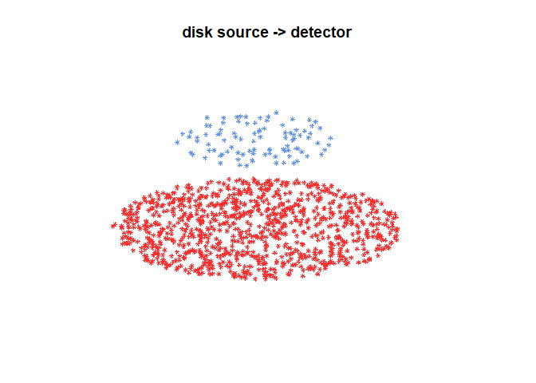
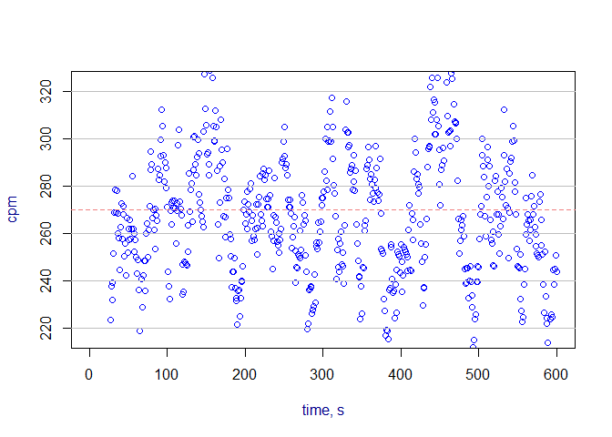

<!-- README.md is generated from README.Rmd. Please edit that file -->

Overview To start using the installed package:

``` r
library(radsafer)
```

The radsafer package was developed with these goals:

- Provide functions that are commonly used in radiation safety

- Provide easy access to data provided in the RadData package

- Share some less commonly-used functions that may be of significant
  value to workers in instrumentation and modeling

Related functions are identified as members of these families:

- decay corrections

- radionuclides

- rad measurements

- mcnp tools

A few functions stand alone.

This framework makes it a little easier to find the function you want -
the help file for each function lists related functions.

### Decay Correction Functions

Radsafer includes several functions to manage radioactive decay
corrections:

**dk_correct** provides decay corrected activity or activity-dependent
value, such as instrument response rate or dose rate. The computation is
made either based on a single radionuclide, or based on user-provided
half-life, with time unit. The differential time is either computed
based on dates entered or time lapsed based on the time unit.

Obtain a correction factor for a source to be used today based on a
calibration on `date1`. Allow `date2` to be the default system date.

``` r
dk_correct(half_life = 10,
           time_unit = "y",
           date1 = "2010-01-01")
#>  half_life RefValue    RefDate   TargDate  dk_value
#>         10        1 2010-01-01 2023-07-11 0.3916907
```

Use this function to correct for the value needed on dates it was used.
Let the function obtain the half-life from the ICRP Publication 107
decay data in the `RadData` R package. In the example, we have a disk
source with an original count rate of 10000 cpm:

``` r
dk_correct(RN_select = "Sr-90",
           date1 = "2005-01-01",
           date2 = c("2009-01-01","2009-10-01"),
           A1 = 10000)
#>     RN half_life units decay_mode
#>  Sr-90     28.79     y         B-
#> 
#>     RN RefValue    RefDate   TargDate dk_value
#>  Sr-90    10000 2005-01-01 2009-01-01 9081.895
#>  Sr-90    10000 2005-01-01 2009-10-01 8919.954
```

Reverse decay - find out what readings should have been in the past
given today’s reading of 3000

``` r
dk_correct(RN_select = "Cs-137", 
  date1 = "2019-01-01", 
  date2 = c("2009-01-01","1999-01-01"), 
  A1 = 3000)
#>      RN half_life units decay_mode
#>  Cs-137   30.1671     y         B-
#> 
#>      RN RefValue    RefDate   TargDate dk_value
#>  Cs-137     3000 2019-01-01 2009-01-01 3774.795
#>  Cs-137     3000 2019-01-01 1999-01-01 4749.991
```

Other decay functions answer the following questions:

- How long does it take to decay something with a given activity, or how
  old is a sample if it has decayed from? **dk_time**

- Given a percentage reduction in activity, how many half-lives have
  passed.**dk_pct_to_num_half_life**

- Given two or more data points, estimate the half-life:
  **half_life_2pt**

### radionuclides

Search by alpha, beta, photon or use the general screen option.

`RN_search_phot_by_E` allows screening based on energy, half-life, and
minimum probability. Also available are `RN_search_alpha_by_E`,
`RN_search_beta_by_E`, and `bin_screen_phot`. `RN_bin_screen_phot`
allows limiting searches to radionuclides with emissions in an energy
bin of interest with additional filters for not having photons in other
specified energy bins. Results for all these search functions may be
plotted with `RN_plot_spectrum`.

Here’s a search for photon energy between 0.99 and 1.01 MeV, half-life
between 13 and 15 minutes, and probability at least 1e-3

``` r
search_results <- RN_search_phot_by_E(0.99, 1.01, 13 * 60, 15 * 60, 1e-3)
```

| RN     | code_AN |   E_MeV |      prob | half_life | units | decay_constant |
|:-------|:--------|--------:|----------:|----------:|:------|---------------:|
| Pr-136 | G       | 0.99100 | 0.0016768 |     13.10 | m     |      0.0008819 |
| Pr-136 | G       | 1.00070 | 0.0503040 |     13.10 | m     |      0.0008819 |
| Re-178 | G       | 1.00440 | 0.0057600 |     13.20 | m     |      0.0008752 |
| Pr-147 | G       | 0.99597 | 0.0083220 |     13.40 | m     |      0.0008621 |
| Nb-88  | G       | 0.99760 | 0.0041000 |     14.50 | m     |      0.0007967 |
| Mo-101 | G       | 1.00740 | 0.0017300 |     14.61 | m     |      0.0007907 |
| Sm-140 | G       | 0.99990 | 0.0012000 |     14.82 | m     |      0.0007795 |

``` r
RN_plot_spectrum(search_results)
#> [1] "No matches"
```

You can also plot a spectrum in one step, skipping the data save:

``` r
 RN_plot_spectrum(
   desired_RN = c("Pu-238", "Pu-239", "Am-241"), rad_type = "A",
   photon = FALSE, prob_cut = 0.01, log_plot = 0)
```


The `RN_index_screen` function helps find a radionuclide of interest
based on decay mode, half-life, and total emission energy.

In this example, we search for radionuclides decaying by spontaneous
fission with half-lives between 6 months and 2 years.

``` r
RNs_selected <- RN_index_screen(dk_mode = "SF", min_half_life_seconds = 0.5 * 3.153e7, max_half_life_seconds = 2 * 3.153e7)
```

| RN     | half_life | units |
|:-------|----------:|:------|
| Es-254 |     275.7 | d     |
| Cf-248 |     334.0 | d     |

Other radionuclides family functions:

- Obtain a specific activity with **RN_Spec_Act**.

- Find a potential radionuclide parent with **RN_find_parent**.

``` r

RN_find_parent("Th-230")
#>       RN
#> 1 Ac-230
#> 2 Pa-230
#> 3  U-234
```

### rad measurements functions

**air_dens_cf** Correct *vented ion chamber readings* based on
difference in air pressure (readings in degrees Celsius and mm Hg):

``` r
air_dens_cf(T.actual = 30, P.actual = 760, T.ref = 20, P.ref = 760)
#> [1] 1.034112
```

Let’s try it out combined with the instrument reading:

``` r
rdg <- 100
(rdg_corrected <- rdg * air_dens_cf(T.actual = 30, P.actual = 760, T.ref = 20, P.ref = 760))
#> [1] 103.4112
```

**neutron_geom_cf**

Correct for *geometry* when reading a close *neutron* source. Example:
neutron rem detector with a radius of 11 cm and source near surface:

``` r
neutron_geom_cf(11.1, 11)
#> [1] 0.7236467
```

**disk_to_disk_solid_angle**

Correct for a mismatch between the *source calibration* of a *counting
system* and the item being measured. A significant factor in the
counting efficiency is the solid angle from the source to the detector.
You can also check for the impact of an item not being centered with the
detector.

Example: You are counting an air sample with an active collection
diameter of 45 mm, your detector has a radius of 25 mm and there is a
gap between the two of 5 mm. (The function is based on radius, not
diameter so be sure to divide the diameter by two.) The relative solid
angle is:

``` r
(as_rel_solid_angle <- as.numeric(disk_to_disk_solid_angle(r.source = 45/2, gap = 20, r.detector = 12.5, runs = 1e4, plot.opt = "n")))
#> [1] 0.047469927 0.002120278
```

An optional plot is available in 2D or 3D:

``` r
  library(ggplot2)
theme_update(# axis labels
             axis.title = element_text(size = 7),
             # tick labels
             axis.text = element_text(size = 5),
             # title 
             title = element_text(size = 5))
(as_rel_solid_angle <- as.numeric(disk_to_disk_solid_angle(r.source = 45/2, gap = 20, r.detector = 12.5, runs = 1e4, plot.opt = "3d")))
```



    #> [1] 0.047585442 0.002137657

Continuing the example: the only calibration source you had available
with the appropriate isotope has an active diameter of 20 mm. Is this a
big deal? Let’s estimate the relative solid angle of the calibration,
then take a ratio of the two.

``` r
(cal_rel_solid_angle <- disk_to_disk_solid_angle(r.source = 20, gap = 20, r.detector = 12.5, runs = 1e4, plot.opt = "n"))
#>   mean_eff         SEM
#>  0.0528169 0.002243531
```

Correct for the mismatch:

``` r
(cf <- cal_rel_solid_angle / as_rel_solid_angle)
#>  mean_eff      SEM
#>  1.109938 1.049528
```

This makes sense - the air sample has particles originating outside the
source radius, so more of them will be lost, thus an adjustment is
needed for the activity measurement.

**scaler_sim**

*Scaler counts*: obtain quick distributions for parameters of interest:

``` r
scaler_sim(true_bkg = 50, true_samp = 10, ct_time = 20, trials = 1e5)
```


**rate_meter_sim**

*Rate meters*: In the ratemeter simulation, readings are plotted once
per second for a default time of 600 seconds. The meter starts with a
reading of zero and builds up based on the time constant. Resolution
uncertainty is established to express the uncertainty from reading an
analog scale, including the instability of its readings. Many standard
references identify the precision or resolution uncertainty of analog
readings as half of the smallest increment. This should be considered
the single coverage uncertainty for a very stable reading. When a
reading is not very stable, evaluation of the reading fluctuation is
evaluated in terms of numbers of scale increments covered by meter
indication over a reasonable evaluation period. Example with default
time constant:

``` r
rate_meter_sim(cpm_equilibrium = 270, meter_scale_increments = seq(100, 1000, 20))
```



To estimate *time constant*, use `tau.estimate`

### Some stand-alone functions

#### Stay-time computation

Given a dose rate, dose allowed, and a safety margin (default = 20%),
calculate stay time with: `stay_time`

``` r
stay_time(dose_rate = 120, dose_allowed = 100, margin =  20)
#> [1] "Time allowed is 40 minutes"
#> [1] 40
```

#### half-value and tenth value computation

Given a set of radiation levels through varying thicknesses of material,
compute the half-values, tenth-values, and homogeneity coefficients.

``` r
hvl(x = mm_Al, y = mR_h) 
#>   thickness response        mu      hvl      tvl        hc
#> 1         0    7.428        NA       NA       NA        NA
#> 2         1    6.272 0.1691614 4.097550 13.61177 0.9676121
#> 3         2    5.325 0.1636826 4.234704 14.06738 0.9810918
#> 4         3    4.535 0.1605876 4.316317 14.33850 0.9745802
#> 5         4    3.878 0.1565055 4.428899 14.71248 0.9984235
#> 6         5    3.317 0.1562588 4.435892 14.73571        NA
```

### mcnp tools functions

If you create MCNP inputs, these functions may be helpful:

**mcnp_sdef_erg_line** Obtain emission data from the `RadData` package
for use with the radiation transport code, MCNP, when you want a “line”
source from individual radionuclides. Use **mcnp_sdef_erg_hist** when
you have histogram data and want to format it nicely for MCNP.

**mcnp_matrix_rotations**

- Determine the entries needed for MCNP *coordinate transformation
  rotation*

``` r
mcnp_matrix_rotations("z", 90)
#> [1]  0  1  0 -1  0  0  0  0  1
```

**mcnp_cone_angle** This is just the square of the tangent of the angle
in radians, but the argument used here is degree.

``` r
mcnp_cone_angle(30)
#> [1] 0.3333333
```

**mcnp_mesh_bins** This helps identify the x, y, or z parameter of a
simple geometric mesh tally. Select a center of interest, the width of
this center mesh, then minimum and maximum limits on the extent of the
entire mesh. Repeat for the other dimensions.

``` r
mcnp_mesh_bins(target = 30, width = 10, lowest_less = 0, highest_less = 15, highest_high = 304.8, lowest_high = 250)
#>  low_set high_set width numblocks
#>        5      295    10        29
```

**mcnp_plot_out_spec**

For *MCNP outputs*, plot the results of a tally with *energy bins*. The
fastest way to do this is with `mcnp_scan2plot`.

Alternatively, if you want to get your data into R, first save it in a
text file and import it to R. (Base R provides methods with `read.table`
or you might prefer options from the `readr` or `readxl` packages.) Or
you can copy and paste your data using `mcnp_scan_save`. You can then
plot with `mcnp_plot_out_spec` (below) or design your own plot.

``` r
mcnp_plot_out_spec(photons_cs137_hist, 'example Cs-137 well irradiator')
```


