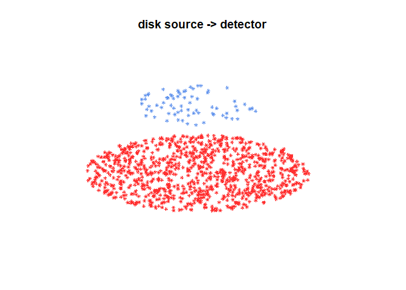
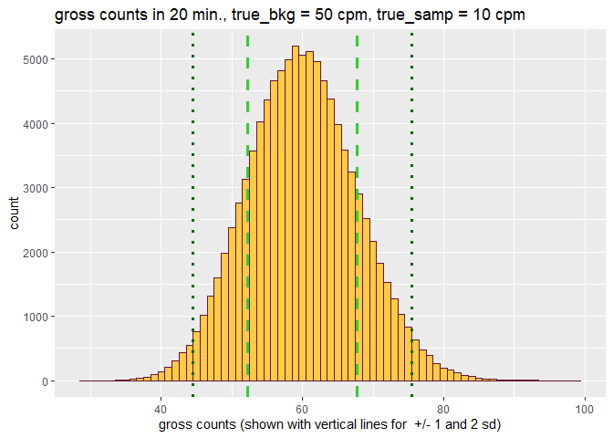
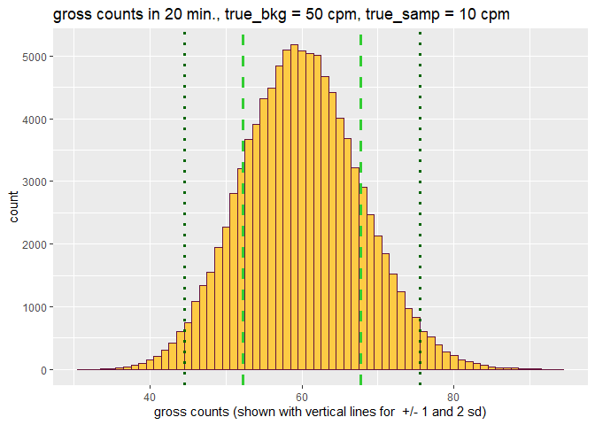

<!-- README.md is generated from README.Rmd. Please edit that file -->

# radsafer 

[](https://r-pkg.org/pkg/radsafer)
[](https://travis-ci.org/markhogue/radsafer)

The goal of radsafer is to provide functions that are useful for
radiation safety professionals.

## Installation

You can install the released version of radsafer from
[CRAN](https://CRAN.R-project.org) with:

``` r
install.packages("radsafer")
```

Or install the development version from GitHub:

``` r
# install.packages("devtools")
devtools::install_github("markhogue/radsafer")
```

## Oveview

To start using the installed package:

``` r
library(radsafer)
```

## radsafer families of functions

  - Related functions are identified as members of families:
      - rad measurements
      - mcnp tools
      - decay corrections
      - radionuclides

### Decay Correction Functions

Radsafer includes several functions to manage radioactive decay
corrections:

**dk\_cf** provides a correction factor. Revise a calibration or source
check value to today’s date (the default) or a date and time of your
choosing.

``` r
dk_cf(half_life = 5.27, date1 = "2010-12-01", date2 = "2018-12-01", time_unit = "y")
#> [1] 0.3491632
```

Use this function to correct for the value needed today. Say, a disk
source originally had a target count rate of 3000
cpm:

``` r
3000 * dk_cf(half_life = 5.27, date1 = "2010-12-01", date2 = "2018-12-01", time_unit = "y")
#> [1] 1047.49
```

Other decay functions answer the following questions: \* What is the
decayed activity? **dk\_activity**, Given a percentage reduction in
activity, how many half-lives have
passed.**dk\_pct\_to\_num\_half\_life**

  - How long will it take to reach the target radioactivity?
    **dk\_time**

  - Given the radioactivity at one time, what was the radioactivity at
    an earlier time? **dk\_reverse**

  - Given two data points, estimate the half-life: **half\_life\_2pt**

### rad measurements functions

**air\_dens\_cf** Correct *vented ion chamber readings* based on
difference in air pressure (readings in degrees Celsius and mm Hg):

``` r
air_dens_cf(T.actual = 30, P.actual = 760, T.ref = 20, P.ref = 760)
#> [1] 1.034112
```

Let’s try it out combined with the instrument reading:

``` r
rdg <- 100
(rdg_corrected <- rdg * air_dens_cf(T.actual = 30, P.actual = 760, T.ref = 20, P.ref = 760))
#> [1] 103.4112
```

**neutron\_geom\_cf**

Correct for *geometry* when reading a close *neutron* source. Example:
neutron rem detector with a radius of 11 cm and source near surface:

``` r
neutron_geom_cf(11.1, 11)
#> [1] 0.7236467
```

**disk\_to\_disk\_solid\_angle**

Correct for a mismatch between the *source calibration* of a *counting
system* and the item being measured. A significant factor in the
counting efficiency is the solid angle from the source to the detector.
You can also check for the impact of an item not being centered with the
detector.

Example: You are counting an air sample with an active collection
diameter of 45 mm, your detector has a radius of 25 mm and there is a
gap between the two of 5 mm. (The function is based on radius, not
diameter so be sure to divide the diameter by two.) The relative solid
angle
is:

``` r
(as_rel_solid_angle <- as.numeric(disk_to_disk_solid_angle(r.source = 45/2, gap = 20, r.detector = 12.5, runs = 1e4, plot.opt = "n")))
#> [1] 0.04797122 0.00213652
```

An optional plot is available in 2D or
3D:

``` r
(as_rel_solid_angle <- as.numeric(disk_to_disk_solid_angle(r.source = 45/2, gap = 20, r.detector = 12.5, runs = 1e4, plot.opt = "3d")))
```



    #> [1] 0.047264923 0.002120248

Continuing the example: the only calibration source you had available
with the appropriate isotope has an active diameter of 20 mm. Is this a
big deal? Let’s estimate the relative solid angle of the calibration,
then take a ratio of the
two.

``` r
(cal_rel_solid_angle <- disk_to_disk_solid_angle(r.source = 20, gap = 20, r.detector = 12.5, runs = 1e4, plot.opt = "n"))
#>    mean_eff         SEM
#>  0.05335335 0.002248608
```

Correct for the mismatch:

``` r
(cf <- cal_rel_solid_angle / as_rel_solid_angle)
#>  mean_eff     SEM
#>  1.128815 1.06054
```

This makes sense - the air sample has particles originating outside the
source radius, so more of them will be lost, thus an adjustment is
needed for the activity measurement.

**scaler\_sim**

*Scaler counts*: obtain quick distributions for parameters of interest:

``` r
scaler_sim(true_bkg = 50, true_samp = 10, ct_time = 20, trials = 1e5)
```



**rate\_meter\_sim**

*Rate meters*: In the ratemeter simulation, readings are plotted once
per second for a default time of 600 seconds. The meter starts with a
reading of zero and builds up based on the time constant. Resolution
uncertainty is established to express the uncertainty from reading an
analog scale, including the instability of its readings. Many standard
references identify the precision or resolution uncertainty of analog
readings as half of the smallest increment. This should be considered
the single coverage uncertainty for a very stable reading. When a
reading is not very stable, evaluation of the reading fluctuation is
evaluated in terms of numbers of scale increments covered by meter
indication over a reasonable evaluation period. Example with default
time
constant:

``` r
rate_meter_sim(cpm_equilibrium = 270, meter_scale_increments = seq(100, 1000, 20))
```



To estimate *time constant*, use `tau.estimate`

### Stay-time computation

Given a dose rate, dose allowed, and a safety margin (default = 20%),
calculate stay time with: `stay_time`

``` r
stay_time(dose_rate = 120, dose_allowed = 100, margin =  20)
#> [1] "Time allowed is 40 minutes"
#> [1] 40
```

### mcnp tools functions

If you create MCNP inputs, these functions may be helpful:

**mcnp\_si\_sp\_RD** Obtain emission data from the RadData package and
write to a file for use with the radiation transport code, MCNP.

**mcnp\_si\_hist** and **mcnp\_sp\_hist**

  - Create an *energy distribution* from histogram data with: `si_hist`
    and `sp_hist` (Load the data into R first using copy and paste with
    `scan` or reading from an external table with, for example,
    `read.table`.)

**mcnp\_matrix\_rotations**

  - Determine the entries needed for MCNP *coordinate transformation
    rotation*

**mcnp\_cone\_angle**

  - Quickly obtain the *cone angle* entry

**mcnp\_plot\_out\_spec**

For *MCNP outputs*, plot the results of a tally with *energy bins*.
Either first save your data to a text file, or copy and paste it using
`mcnp_scan2spec.df`. Then plot it using your favorite method, or do a
quick plot with `mcnp_plot_out_spec`:

``` r
mcnp_plot_out_spec(photons_cs137_hist, 'example Cs-137 well irradiator')
```


### radionuclides

Search by alpha, beta, photon or use the general screen option.

`search_phot_by_E` allows screening based on energy, half-life, and
minimum probability. Also available are `search_alpha_by_E`,
`search_beta_by_E`, and `bin_screen_phot`. `bin_screen_phot` allows
limiting searches to radionuclides with emissions in an energy bin of
interest with additional filters for not having photons in other
specified energy bins. Results for all these search functions may be
plotted with `RN_plt`.

Here’s a search for photon energy between 0.99 and 1.01 MeV, half-life
between 13 and 15 minutes, and probability at least
1e-4

``` r
search_results <- search_phot_by_E(0.99, 1.01, 13 * 60, 15 * 60, 1e-4)
```

| RN     | code\_AN |  E\_MeV |      prob | half\_life | units | decay\_constant |
| :----- | :------- | ------: | --------: | ---------: | :---- | --------------: |
| Pr-136 | G        | 0.99100 | 0.0016768 |      13.10 | m     |       0.0008819 |
| Pr-136 | G        | 1.00070 | 0.0503040 |      13.10 | m     |       0.0008819 |
| Re-178 | G        | 1.00440 | 0.0057600 |      13.20 | m     |       0.0008752 |
| Pr-147 | G        | 0.99597 | 0.0083220 |      13.40 | m     |       0.0008621 |
| Xe-138 | G        | 0.99680 | 0.0006300 |      14.08 | m     |       0.0008205 |
| Nb-88  | G        | 0.99760 | 0.0041000 |      14.50 | m     |       0.0007967 |
| Mo-101 | G        | 1.00740 | 0.0017300 |      14.61 | m     |       0.0007907 |
| Sm-140 | G        | 0.99990 | 0.0012000 |      14.82 | m     |       0.0007795 |

``` r
RN_plt(spec_0.1_0.3)
```


The `RN_index_screen` function helps find a radionuclide of interest
based on decay mode, half-life, and total emission energy.

In this example, we search for radionuclides decaying by spontaneous
fission with half-lives between 6 months and 2
years.

``` r
RNs_selected <- RN_index_screen(dk_mode = "SF", min_half_life_seconds = 0.5 * 3.153e7, max_half_life_seconds = 2 * 3.153e7)
```

| RN     | half\_life | units |
| :----- | ---------: | :---- |
| Es-254 |      275.7 | d     |
| Cf-248 |      334.0 | d     |

Other radionuclides family functions provide specific activity and short
tables of decay data.
